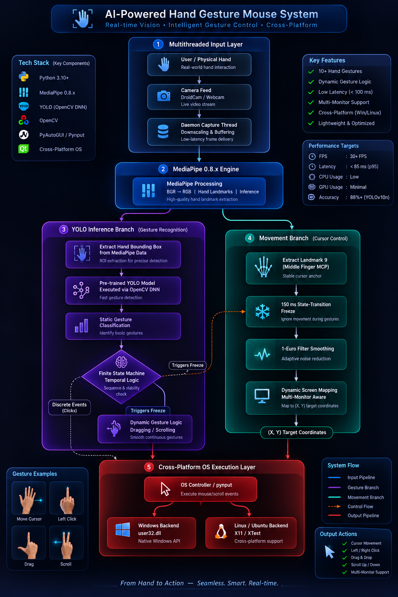

# AI-Powered Hand Gesture Mouse System

<p align="center">
  
  
  
  
  
  
</p>

> A vision-based intelligent agent that replaces the physical mouse with a bare
> hand, using a webcam as its only sensor.

---

## Overview

The **AI-Powered Hand Gesture Mouse System** is a real-time perceptual agent
that observes a user's hand through a commodity webcam and translates its
posture and position into operating-system pointer events. It is designed to
run as a lightweight foreground process on ordinary consumer hardware, with no
GPU, no depth sensor, and no calibration step.

The agent closes a continuous perception–action loop. Each frame is acquired
on a dedicated capture thread, reduced to a 21-point hand skeleton by
MediaPipe Hands, and then routed down **two independent processing branches**:
a latency-critical *movement* branch that must respond within a single frame,
and a *gesture recognition* branch that answers the slower question of what the
user intends. Separating them is the central design decision of the project —
it allows cursor motion to remain smooth and immediate even while
classification is comparatively expensive.

A recurring theme throughout the implementation is **empirical justification**.
Parameters such as the smoothing cutoff, the active-region margins, and the
inference resolution were not chosen by intuition; each was profiled, and the
measurements are documented alongside the constants they justify.

---

## Features

### Movement and Control

- **Biomechanical anchor (Landmark 9).** The cursor tracks the *middle-finger
  MCP knuckle* rather than a fingertip. A fingertip is the most mobile point on
  the hand — every gesture displaces it by definition — whereas the knuckle is
  carried by the palm. Measured across four pose transitions, the worst-moving
  fingertip travelled **108 px** while Landmark 9 moved **0.0 px**, eliminating
  gesture-induced cursor lurch at the source.
- **1 € Filter smoothing** (Casiez, Roussel & Vogel, CHI 2012). A speed-adaptive
  low-pass filter: heavy smoothing at rest to suppress landmark jitter, opening
  up during fast motion to avoid lag. Tuned to `min_cutoff = 1.0`,
  `β = 0.015`, with a measured α-response table documented in-source.
- **150 ms anti-drift state freeze.** Changing hand pose physically shifts the
  whole hand. On every gesture transition the target coordinate is pinned for
  150 ms, absorbing the twitch, then released so the pose can still be dragged.
  The frozen point is fed *through* the filter rather than bypassing it, so
  motion resumes by gliding instead of jumping.
- **Runtime tuning without restart.** Sensitivity (`+`/`-`, clamped 1.0×–3.0×),
  preview mirroring (`m`), and control-axis inversion (`i`) are all live.

### Display and Geometry

- **Multi-monitor virtual-desktop mapping.** The active region maps onto the
  bounding rectangle of *all* displays (`SM_*VIRTUALSCREEN` / X11 root window),
  including monitors positioned left of or above the primary, which report
  negative coordinates. Verified against a 3840 × 1080 dual-monitor desktop.
- **Display hot-plug support.** Desktop geometry is re-polled every 2.5 s and
  the mapping rebuilt atomically when a monitor is added, removed, or
  rearranged — with degenerate mid-reconfiguration rectangles rejected.
- **Asymmetric bounding-box padding.** Vertical margins are deliberately
  unequal (`MARGIN_TOP = 0.10`, `MARGIN_BOTTOM = 0.28`) because a hand can
  raise well above shoulder height but stops against the desk on the way down.
  The screen bottom is therefore reached at **72 %** down the camera frame
  rather than 100 %, placing the taskbar inside natural arm range.
- **Camera-agnostic operation.** Resolution, aspect ratio, and field of view are
  discovered at runtime; a 1080p virtual camera and a 480p laptop sensor
  produce the same relative control geometry.

### Engineering

- **Multithreaded capture.** A daemon `WebcamStream` decouples the blocking
  `VideoCapture.read()` from the processing loop and publishes each frame as a
  single atomic tuple — lock-free, with no torn reads across 20 000 samples.
- **Allocation-free steady state.** All per-frame image transforms write into
  preallocated buffers. Measured: **+672 bytes** retained over 20 000 iterations.
- **Zero-copy inference hand-off.** The RGB buffer is marked non-writeable
  around `hands.process()` so MediaPipe borrows rather than copies it.
- **Decoupled inference resolution.** The preview renders at 640 × 360 while
  MediaPipe is fed an exact 1:2 downscale at 320 × 180 — measured at
  **37.3 ms → 32.2 ms** per frame (≈ 26.4 → 30.9 FPS).

---

## Tech Stack

| Component       | Choice                     | Version                             | Rationale                                               |
| --------------- | -------------------------- | ----------------------------------- | ------------------------------------------------------- |
| Language        | Python                     | **3.8.10 / 3.10.11**          | Required by the MediaPipe 0.8.x wheels                  |
| Hand skeleton   | MediaPipe Hands            | **0.8.x** (pinned `0.8.11`) | Legacy Solutions API;`model_complexity=0` (Lite)      |
| Vision I/O      | OpenCV (`opencv-python`) | ≥ 4.5, < 5.0                       | Capture, colour conversion, resizing, overlay           |
| Numerics        | NumPy                      | ≥ 1.19                             | Preallocated frame buffers                              |
| Pointer output  | **pynput**           | ≥ 1.7, < 2.0                       | Thin bridge over`user32.dll` and X11                  |
| Screen geometry | `ctypes` + `tkinter`   | stdlib                              | Native virtual-desktop metrics, portable fallback       |
| Gesture model   | `YOLOv10n_gestures.pt`   | —                                  | Custom-trained gesture classifier*(see status below)* |
| Model runtime   | OpenCV DNN                 | ≥ 4.5                              | Avoids a PyTorch/Ultralytics runtime dependency         |

### Academic Compliance — Zero Heavy Frameworks

A binding constraint on this project was that the runtime must not depend on
high-level automation wrappers or heavyweight ML frameworks. The system
satisfies this as follows.

- **No PyAutoGUI.** Pointer control is issued through **pynput**, which resolves
  to `user32.SetCursorPos` on Windows and `XWarpPointer` on X11. This is not
  merely a stylistic preference: PyAutoGUI clamps coordinates to the *primary*
  display and cannot address the negative coordinates a left-positioned second
  monitor requires, which would make multi-monitor traversal impossible. A
  pure-`ctypes` fallback is retained should pynput be unavailable.
- **No PyTorch or Ultralytics at runtime.** The gesture network is executed
  through **OpenCV DNN**, which is already a dependency for video I/O. This
  removes a multi-hundred-megabyte runtime from the deployment footprint.
- **No gesture-recognition libraries.** The geometric classifier is arithmetic
  only — squared Euclidean distances and boolean finger states — with no
  classifier, training data, or third-party gesture SDK.

> [!IMPORTANT]
> **Model format.** OpenCV DNN cannot load PyTorch `.pt` checkpoints;
> `cv2.dnn.readNet` accepts ONNX, Caffe, TensorFlow and Darknet formats.
> `YOLOv10n_gestures.pt` must therefore be **exported to ONNX once, offline**,
> before it can be served by the OpenCV DNN runtime. The export step is given
> in [Installation](#installation--usage). Export is a one-time, build-time
> operation and does not reintroduce a PyTorch dependency at runtime.

---

## Architecture



The system is organised as a **dual-branch pipeline** fed by a single shared
perception stage. Both branches consume the same MediaPipe landmark set but
serve different real-time requirements.

### Shared Perception Stage

A daemon capture thread continuously drains the camera and publishes only the
newest frame, so the processing loop never queues stale imagery. Each frame is
mirrored into a preallocated display buffer, downscaled by an exact integer
factor, colour-converted, and passed to MediaPipe Hands, which returns 21
normalised landmarks. Because landmarks are normalised to `[0, 1]` of the input
image, the reduced inference resolution requires **no coordinate correction** —
an exactly-scaled copy reports identical normalised positions.

### Branch A — Movement (pure mathematics, latency-critical)

This branch must complete within a single frame and therefore contains no
learned components.

```
Landmark 9 (MCP knuckle)
      │
      ▼  normalised → preview pixels
Inset active region      [MARGIN_X, 1−MARGIN_X] × [MARGIN_TOP, 1−MARGIN_BOTTOM]
      │
      ▼  piecewise-linear map + saturation
Virtual-desktop coordinates      (origin-aware, multi-monitor)
      │
      ▼  centre-scaled sensitivity, then clamp
1 € Filter (per axis, speed-adaptive)
      │
      ▼
pynput → user32.dll / X11
```

The 150 ms transition freeze is applied *before* the filter, so the filter
remains settled on the frozen point and releases by gliding.

### Branch B — Gesture Recognition (semantic, latency-tolerant)

This branch answers *what the hand means* rather than *where it is*, and is
permitted a longer budget because a misread pose is far costlier than a late
one.

- **Geometric state machine (operational).** A finger is classified as extended
  when its tip lies further from the wrist than its PIP joint —
  `|tip − wrist|² > |pip − wrist|² · k²`. Comparing two distances from a common
  origin makes the test self-normalising: it requires no palm-size divisor and
  holds at any hand distance, frame resolution, or in-plane rotation. Verified
  invariant across **0.4×–1.6×** hand scale and **−40° to +40°** rotation, and
  bit-identical to its reference implementation over 200 000 randomised inputs.
  States: `point`, `peace`, `grip`, `open`, with `idle` as an explicit fallback
  for unrecognised poses.
- **YOLOv10n classifier (integration in progress).** `YOLOv10n_gestures.pt` is a
  custom-trained detector intended to supersede the geometric classifier for
  richer vocabularies that geometry alone cannot separate. It is served through
  OpenCV DNN once exported to ONNX. **This branch is not yet wired into
  `hand_cursor.py`**; the geometric classifier is what executes today. The
  architecture places it here because the branch boundary — landmarks in,
  gesture label out — is designed so the two are interchangeable.

### Why Two Branches

A single-path design would force cursor updates to wait on classification,
coupling pointer latency to model cost. Splitting them means inference can be
throttled, downscaled, or swapped without the cursor ever stuttering, and the
movement path can be reasoned about — and unit-tested — as pure arithmetic.

---

## Installation & Usage

### Prerequisites

- **Python 3.8.10 or 3.10.11.** MediaPipe 0.8.11 publishes no `cp311` wheels, so
  a 3.11+ interpreter cannot satisfy the pin.
- A webcam (built-in, USB, or a virtual source such as DroidCam or OBS).
- **Linux only:** `libx11-6`, plus `libxinerama1` for monitor counting and
  `python3-tk` for the portable screen probe.

### 1. Clone and create the environment

```bash
git clone https://github.com/BangerAtifAhmed/Mouse_Gestures_V1
cd Mousegesture

# conda (recommended — guarantees the interpreter version)
conda create -n gesturemouse python=3.10.11 -y
conda activate gesturemouse

# or venv, given a 3.8.10 / 3.10.11 interpreter
python -m venv .venv
source .venv/bin/activate        # Windows: .venv\Scripts\activate
```

### 2. Install dependencies

```bash
pip install -r requirements.txt
```

On Debian/Ubuntu, install the system libraries as well:

```bash
sudo apt update
sudo apt install libx11-6 libxinerama1 python3-tk
```

### 3. Export the gesture model to ONNX (one-time, build step)

OpenCV DNN cannot read `.pt`. Convert the checkpoint once, in a throwaway
environment, so no PyTorch dependency reaches the runtime:

```bash
# separate environment — this is a build step, not a runtime dependency
python -m venv .export && source .export/bin/activate
pip install ultralytics
yolo export model=model/YOLOv10n_gestures.pt format=onnx opset=12 simplify=True
deactivate

# leaves model/YOLOv10n_gestures.onnx, loadable by cv2.dnn.readNet
```

### 4. Run

```bash
python hand_cursor.py
```

On first launch the application scans camera indices `0–4`, reports what each
one delivers, and prompts for a selection:

```
[SCAN] Checking index 0...
[SCAN]   index 0: OK — 640×480 on attempt 1/5
[SCAN] Checking index 1...
[SCAN]   index 1: OK — 1920×1080 on attempt 3/5

[camera] scan answered on 2 index/indices:
           [0]  640×480  (1.33:1)
           [1]  1920×1080  (1.78:1)
         camera index [Enter = 1]:
```

Press **Enter** for the highest-numbered source (usually the external or
virtual camera), or type any index — including one the scan missed, since slow
virtual drivers occasionally fail to answer in time.

### Runtime Controls

The preview window must hold keyboard focus.

|      Key      | Action                                                             |
| :-----------: | ------------------------------------------------------------------ |
| `+` / `=` | Increase cursor sensitivity (max 3.0×)                            |
| `-` / `_` | Decrease cursor sensitivity (min 1.0×)                            |
|     `m`     | Toggle preview mirroring — flips picture*and* control direction |
|     `i`     | Toggle X-axis inversion — control only, picture unchanged         |
|     `q`     | Quit                                                               |

### Configuration

All tuning constants sit at the top of `hand_cursor.py`, each documented with
the measurement that justifies it:

| Constant                           | Default             | Purpose                                    |
| ---------------------------------- | ------------------- | ------------------------------------------ |
| `CURSOR_SENSITIVITY`             | `1.0`             | Starting gain; adjustable at runtime       |
| `MARGIN_X`                       | `0.15`            | Horizontal inset, each side                |
| `MARGIN_TOP` / `MARGIN_BOTTOM` | `0.10` / `0.28` | Asymmetric vertical inset                  |
| `STATE_FREEZE_MS`                | `150`             | Anti-drift hold on gesture transition      |
| `MIN_CUTOFF` / `BETA`          | `1.0` / `0.015` | 1 € Filter response                       |
| `INFER_MAX_WIDTH`                | `320`             | Inference width;`0` disables downscaling |
| `MIN_TRACKING_CONFIDENCE`        | `0.5`             | Lower keeps the cheap tracker engaged      |
| `CAM_INDEX`                      | `None`            | Pin a camera to skip the scan and prompt   |

### Troubleshooting

| Symptom                          | Cause and remedy                                                    |
| -------------------------------- | ------------------------------------------------------------------- |
| Cursor moves the wrong way       | Press`m`; if the picture is right but control is not, press `i` |
| Black preview at 0 FPS           | Backend incompatibility — set`CAMERA_API = cv2.CAP_MSMF`         |
| Virtual camera missing from scan | Raise`CAM_SCAN_READ_TRIES`, or type its index anyway              |
| Cursor cannot reach the taskbar  | Increase`MARGIN_BOTTOM`                                           |
| Second monitor unreachable       | Confirm the banner reports`Screen src : native`                   |

---

## Acknowledgements

* **G. Casiez, N. Roussel and D. Vogel**, *[1 € Filter: A Simple Speed-based Low-pass Filter for Noisy Input in Interactive Systems](https://dl.acm.org/doi/10.1145/2207676.2208639)*, CHI 2012 — the smoothing stage of the movement branch.
* **F. Zhang et al.**, *[MediaPipe Hands: On-device Real-time Hand Tracking](https://arxiv.org/abs/2006.10214)*, CVPR Workshops 2020 — the shared perception stage.
* **A. Wang et al.**, *[YOLOv10: Real-Time End-to-End Object Detection](https://arxiv.org/abs/2405.14458)*, 2024 — the gesture-recognition branch.

### Model Licensing & Citation

This project utilizes the `YOLOv10n` gesture detection model (`YOLOv10n_gestures.pt`), which is provided as a pre-trained baseline from the **HaGRIDv2** dataset project.

**License:**
This work is licensed under a variant of the **Creative Commons Attribution-ShareAlike 4.0 International License (CC BY-SA 4.0)**.

**Authors and Credits:**
Alexander Kapitanov, Andrey Makhlyarchuk, Karina Kvanchiani, Aleksandr Nagaev, Roman Kraynov, and Anton Nuzhdin.

**Project Links:**
* [HaGRIDv2-1M GitHub Repository](https://github.com/hukenovs/hagrid)
* [HaGRIDv2 arXiv Paper](https://arxiv.org/abs/2412.01508)

**Citation:**
```bibtex
@misc{nuzhdin2024hagridv21mimagesstatic,
    title={HaGRIDv2: 1M Images for Static and Dynamic Hand Gesture Recognition},
    author={Anton Nuzhdin and Alexander Nagaev and Alexander Sautin and Alexander Kapitanov and Karina Kvanchiani},
    year={2024},
    eprint={2412.01508},
    archivePrefix={arXiv},
    primaryClass={cs.CV},
    url={https://arxiv.org/abs/2412.01508},
}

@InProceedings{Kapitanov_2024_WACV,
    author    = {Kapitanov, Alexander and Kvanchiani, Karina and Nagaev, Alexander and Kraynov, Roman and Makhliarchuk, Andrei},
    title     = {HaGRID -- HAnd Gesture Recognition Image Dataset},
    booktitle = {Proceedings of the IEEE/CVF Winter Conference on Applications of Computer Vision (WACV)},
    month     = {January},
    year      = {2024},
    pages     = {4572-4581}
}
```

---

<p align="center"><sub>
Built as a capstone project. Movement is pure mathematics; only recognition is learned.
</sub></p>
